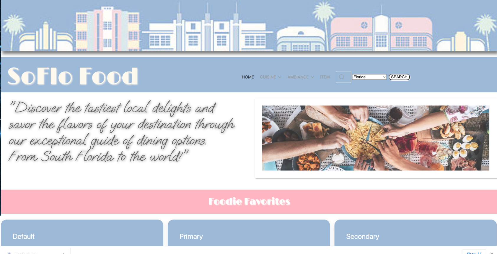

# Group 11 Project 1-SoFloFood

## Description

The primary goal of this project was to develop an app that assists users in finding the ideal dining experience based on the ambiance and cuisine type, whether they are tourists exploring a new city or locals seeking fresh places to dine. Essentially, it's like providing a solution to the timeless question, "where should we eat?"

We encountered various challenges throughout the journey, mainly because none of us had any prior coding experience. Nevertheless, as we progressed, we were able to enhance our critical thinking skills, foster better teamwork, and grasp new knowledge from our Boot Camp experience. While acknowledging that there's still much more to learn, maintaining an open and receptive approach to learning will undoubtedly be a key factor in achieving our goals and success.

## Installation

N/A

## Usage

This site may now be accessed with all its updated features by visiting the hyperlink below: 

<!-- Insert Deployed Link Here -->

The page will welcome you with the following image:

## Credits

An essential component of successfully completing this assignment, was the ability to build and work with a team. We would like to attribute the success of meeting this project's acceptance criteria to the contributions of Group 11 team members: Danielle Sternthal, Lina Quintana, Kayleigh Fitzgerald Gazzolo, and Annielys Sosa.
 
To supplement the design of the application, the following sites and technologies were utilized:
-Canva.com  
-Google Fonts for unique fonts
-W3 Schools for CSS notes
-MDN Web Docs for CSS notes
-GetUIKit.com

-RapidAPI 
Google Maps
OpenWeather Geocoding
Restaurants Near Me

## License

MIT License: []

--